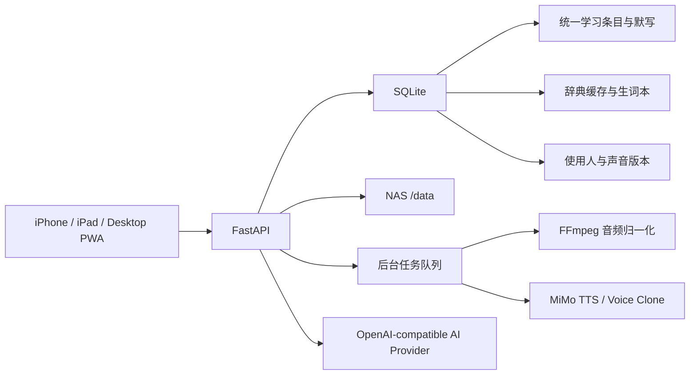

# 家庭学习助手扩展设计：电子辞典、句子默写与多人声音档案

## 1. 文档目的

本文是现有“家庭学习助手”的增量设计规格，供后续开发模型直接实施。它覆盖以下已经确认的需求：

- 单词与句子使用同一套学习、默写、发音、错题和统计流程。
- 电子辞典支持英文转中文、中文转英文，也支持单词、短语和完整句子。
- 电子辞典的解释与翻译使用独立 AI 配置，优先兼容用户的 OpenCode Go 套餐，但不把供应商或模型名写死。
- 辞典查询结果可以标记“不认识”，进入生词本并用于后续复习默写。
- MiMo 声音克隆完整放入 UI：录音、上传、试听、保存、切换、设为默认。
- 每位使用人可保存多个声音版本，但只能有一个默认声音版本。
- 声音档案支持密码加密导出和导入，并绑定使用人，方便更换 NAS 或切换朗读人。
- 句子默写继续使用“播放 -> 孩子手写 -> 家长显示答案 -> 家长人工判定”的方式，不做 OCR 自动判分。
- 所有新增 UI 继续适配 iPhone、iPad 和桌面浏览器。

本文不替代原始设计，而是它的增量规格。发生冲突时，本文件中与“学习条目、辞典、声音档案、AI 配置”有关的要求优先。

## 2. 已核实的 MiMo 声音克隆能力

官方文档：`https://platform.xiaomimimo.com/static/docs/usage-guide/speech-synthesis-v2.5.md`。

MiMo 当前提供三个不同用途的模型：

| 模型 | 用途 | 本系统用途 |
| --- | --- | --- |
| `mimo-v2.5-tts` | 内置音色 | 默认 Chloe 等预设音色 |
| `mimo-v2.5-tts-voicedesign` | 用文字描述设计新音色 | 本期不做主要入口，保留扩展能力 |
| `mimo-v2.5-tts-voiceclone` | 用参考音频克隆真实音色 | “我的声音”功能 |

声音克隆调用继续使用 `POST {base_url}/chat/completions`，Header 为 `api-key`。请求中的 `audio.voice` 是参考音频 Data URI：

```json
{
  "model": "mimo-v2.5-tts-voiceclone",
  "messages": [
    {"role": "user", "content": "Read clearly in standard American English at a calm dictation pace."},
    {"role": "assistant", "content": "apple"}
  ],
  "audio": {
    "format": "wav",
    "voice": "data:audio/wav;base64,<REFERENCE_AUDIO>"
  }
}
```

官方限制：参考音频只支持 MP3 或 WAV，转成 Base64 后不能超过 10 MB。网页录音可能产生 MP4/M4A/WebM，因此系统必须先在 NAS 用 FFmpeg 归一化为 24 kHz、单声道、16-bit PCM WAV，并再次检查 Base64 大小后才允许启用该声音版本。

## 3. 范围与非目标

### 3.1 本期范围

1. 统一学习条目，支持 `word`、`phrase`、`sentence` 三种类型。
2. 单词/句子混排导入和默写。
3. 双向电子辞典、查询历史、AI 缓存、生词标记和生词复习列表。
4. 独立 AI 服务配置和测试入口。
5. 多使用人、多声音版本、默认声音、会话临时切换。
6. MiMo 参考声音录音、上传、FFmpeg 处理、克隆试听。
7. 密码加密的声音档案导入/导出。
8. 相关统计、备份、迁移、审计和三端 UI。

### 3.2 明确不做

- 不自动判断孩子手写内容是否正确。
- 不从网络词典抓取或复制受版权保护的整库内容。
- 不将参考声音、API Key 或查询内容上传到除用户配置的 AI/TTS 服务之外的第三方。
- 不把 OpenCode Go 的接口地址或模型名硬编码到代码；由 UI 配置。
- 不提供公开分享声音包的功能。
- 不自动把每一次辞典查询加入生词本，必须由家长主动标记。

## 4. 总体架构



群晖单容器发布变体在一个容器内启动 Web/API 与 Worker，并使用同一个 `/data`。AI 辞典查询是短请求，可由 API 同步调用并设置 45 秒超时；声音处理和批量 TTS 仍由容器内后台 Worker 执行。开发和横向扩展部署可继续拆分为独立 API/Worker 容器。

## 5. 统一学习条目

### 5.1 兼容策略

现有 SQLite 物理表 `word_lists`、`word_list_versions`、`word_items` 和历史外键不重建、不删除。Python 领域名称升级为：

- `LearningList` 映射到 `word_lists`
- `LearningListVersion` 映射到 `word_list_versions`
- `LearningItem` 映射到 `word_items`

为兼容旧代码，保留 `WordList = LearningList`、`WordListVersion = LearningListVersion`、`WordItem = LearningItem` 的临时别名，直到所有调用迁移完成。旧 API `/api/word-lists` 在一个兼容周期内保留，新 UI 使用 `/api/learning-lists`。

### 5.2 `LearningItem` 新字段

| 字段 | 类型 | 规则 |
| --- | --- | --- |
| `item_type` | String(20) | `word`、`phrase`、`sentence`；旧数据迁移为 `word` |
| `display_text` | Text | 原文，保留大小写和标点 |
| `normalized_text` | Text | NFKC、合并空白；英文用于去重时 casefold |
| `source_language` | String(10) | `en` 或 `zh` |
| `target_language` | String(10) | `zh` 或 `en` |
| `translation_text` | Text nullable | 已确认翻译，可由辞典结果带入 |
| `dictionary_entry_id` | FK nullable | 来源辞典查询记录 |
| `tts_asset_id` | FK nullable | 旧默认音频兼容字段，新音频关系见下文 |

类型判断规则：英文单 token 且包含字母为 `word`；2–5 个英文 token 且没有句末标点可建议为 `phrase`；其他内容默认 `sentence`。UI 必须允许家长修改系统建议。

### 5.3 多声音音频关系

现有一个 `tts_asset_id` 无法支持多人声音，因此新增 `learning_item_audio`：

| 字段 | 说明 |
| --- | --- |
| `learning_item_id` | 学习条目 |
| `speaker_profile_id` | 使用人，可为空表示预设 TTS |
| `voice_version_id` | 声音版本，可为空表示预设音色 |
| `tts_asset_id` | 实际 WAV 资源 |
| `config_fingerprint` | 协议、模型、端点、音色、语速、参考音频 SHA-256 的哈希 |

唯一约束：`(learning_item_id, config_fingerprint)`。

## 6. 句子默写

### 6.1 输入与确认

- 粘贴文本时一行视为一个条目，不按空格拆句。
- Excel/Word/PDF 导入继续按行或单元格生成条目。
- 编辑页显示类型、原文、可选翻译、来源和警告。
- 一个学习列表版本允许单词、短语和句子混排。
- 确认版本后不可原地修改；修改产生新版本。

### 6.2 默写流程

1. 家长选择学习列表版本、顺序/随机、朗读使用人和声音版本。
2. 后端创建固定顺序的 `DictationSession`，保存 `speaker_profile_id`、`voice_version_id` 以及声音名称快照。
3. 页面只显示“第 N / 总数”和播放按钮，不显示英文答案。
4. 家长可重复播放；每次播放增加 `play_count`。
5. 孩子在纸上写完后，家长点击“显示答案”。
6. 页面显示原文；若有中文翻译，可折叠显示。
7. 家长选择“正确”或“错误”，系统不自动前进。
8. 未评分条目存在时禁止结束会话。

句子与单词使用相同的人工评分和统计口径，但统计页可以按 `item_type` 分组查看准确率。

## 7. 电子辞典

### 7.1 查询能力

电子辞典接受任意非空文本，最大 2,000 字符：

- 英文单词/短语/句子 -> 中文。
- 中文单词/短语/句子 -> 英文。
- `source_language=auto` 时，包含汉字则判定为 `zh`，否则判定为 `en`。
- 用户可手工切换方向，覆盖自动判断。

### 7.2 AI 返回结构

后端要求 AI 返回单个 JSON 对象，不让前端直接解析自由文本：

```json
{
  "source_language": "en",
  "target_language": "zh",
  "item_type": "word",
  "source_text": "apple",
  "primary_translation": "苹果",
  "phonetic": "/ˈæpəl/",
  "parts_of_speech": [
    {"part": "noun", "meaning": "苹果；苹果树"}
  ],
  "alternatives": [],
  "examples": [
    {"source": "She ate an apple.", "translation": "她吃了一个苹果。"}
  ],
  "usage_note": "常见可数名词。"
}
```

句子查询允许 `phonetic=null`、`parts_of_speech=[]`。中文转英文时 `primary_translation` 必须是最自然的英文表达，`alternatives` 最多 3 条。例句最多 3 条。后端用 Pydantic 校验返回值；校验失败时可追加一次“只修复 JSON 格式”的重试，第二次失败返回稳定错误 `DICTIONARY_RESPONSE_INVALID`。

### 7.3 查询缓存

新增 `dictionary_entries`：

- `query_hash = SHA256(normalized source + direction + provider fingerprint + prompt_version)`。
- 保存结构化 JSON、创建时间、最后访问时间和命中次数。
- 相同配置和输入优先返回缓存，不再次消耗套餐。
- AI 模型、端点或提示词版本变化后产生新缓存，不覆盖旧记录。
- 查询历史按当前孩子隔离，支持删除单条历史；删除历史不删除已加入生词本的条目。

### 7.4 发音

- 英文原文和英文翻译均提供播放按钮。
- 默认使用当前选择的使用人默认声音；可临时切换声音版本。
- 若克隆声音音频尚未生成，创建 `generate_text_tts` 后台任务并轮询。
- 中文结果本期可以显示但不强制提供中文朗读；TTS 供应商支持时可作为后续能力。

## 8. 生词本与“不认识”标记

新增 `unknown_items`，按孩子隔离：

| 字段 | 说明 |
| --- | --- |
| `child_id` | 当前孩子 |
| `dictionary_entry_id` | 原辞典结果，可为空 |
| `item_type` | word/phrase/sentence |
| `source_text` / `normalized_text` | 原文 |
| `source_language` / `target_language` | 方向 |
| `translation_text` | 标记时的主要翻译快照 |
| `status` | `unknown` 或 `mastered` |
| `marked_at` / `mastered_at` | 时间 |

同一孩子、同一语言方向、同一规范化文本只能有一条活跃记录。重复标记是幂等操作。

生词本支持：

- 按单词/短语/句子筛选。
- 按标记时间、错误次数排序。
- 标记“已掌握”或恢复为“不认识”。
- 多选后创建新的草稿学习列表，不修改历史列表版本。
- 从生词本创建的列表可以直接进入现有确认和默写流程。

## 9. 独立 AI 服务配置

### 9.1 与 TTS 完全分离

新增单独的 `AiProviderConfig`，不得复用 `TtsProviderConfig` 的 Key 或模型字段。UI 路径为“设置 -> 电子辞典 AI”。

配置字段：

| 字段 | 默认/限制 |
| --- | --- |
| `protocol` | 当前仅 `openai_chat_compatible` |
| `display_name` | 默认 `OpenCode Go`，可修改 |
| `base_url` | 用户填写，例如供应商的 `/v1` 根地址 |
| `api_key_encrypted` | NAS 本地加密保存 |
| `model` | 用户填写，不写死 |
| `temperature` | 默认 0.1，允许 0–1 |
| `timeout_seconds` | 默认 45，允许 10–120 |
| `enabled` | 是否启用 |

调用接口为 `POST {base_url}/chat/completions`，Header 为 `Authorization: Bearer <key>`。若 OpenCode Go 套餐提供不同协议，后续新增适配器，不修改辞典领域服务。

### 9.2 UI 功能

- 获取配置时只返回 `api_key_configured` 和掩码，不返回密钥。
- 密钥输入框永远为空；留空保存表示保留旧密钥。
- “测试连接”用固定无隐私文本 `apple`，验证 HTTP、鉴权和 JSON 结构。
- 测试成功显示供应商名称、模型名和耗时；失败只显示稳定错误，不显示响应 Header 或 Key。

## 10. 使用人与声音档案

### 10.1 使用人模型

这里的“使用人”指提供朗读声音的人，例如爸爸、妈妈，不等同于被学习统计绑定的孩子。

新增 `speaker_profiles`：

- `id`：随机 UUID，跨导入导出保持稳定。
- `display_name`：1–100 字符。
- `note`：可选备注。
- `avatar_color`：预设颜色值，不上传头像也能区分。
- `default_voice_version_id`：每人最多一个默认声音。
- `active`：停用后不在快捷选择器显示，但历史记录保留。

新增 `voice_versions`：

- `speaker_profile_id`。
- `display_name`，例如“原声”“慢速清晰版”。
- `provider=mimo`、`model=mimo-v2.5-tts-voiceclone`。
- `reference_audio_path`、`reference_mime_type=audio/wav`、`reference_sha256`、`duration_ms`、`size_bytes`。
- `style_instruction`，默认“标准美式英语，清晰、自然，适合儿童默写，速度稍慢”。
- `status`：`processing`、`ready`、`failed`、`disabled`。
- `failure_code`，不保存上游原始敏感响应。
- `created_at`。

同一使用人可有多个 ready 版本，但只能有一个默认版本。删除使用人或声音版本使用软删除；若已有历史默写引用，禁止物理删除。

### 10.2 UI 录音与上传

“设置 -> 我的声音”提供：

1. 创建/选择使用人。
2. 浏览器录制 8–30 秒参考音频，或上传 WAV/MP3/M4A/MP4/WebM。
3. 显示明确同意复选框：“这是我本人或已获授权的声音，我同意将其发送到当前配置的 MiMo 服务用于声音克隆。”未勾选不能提交。
4. 上传到 NAS 后创建 `normalize_voice_sample` 任务。
5. Worker 使用 FFmpeg 去除视频轨、裁剪到最多 30 秒、转为 24 kHz mono PCM WAV。
6. ffprobe 验证有且只有一个音频流、时长 3–30 秒、Base64 后小于 10 MB。
7. 调 MiMo 用固定测试文本生成试听 WAV。试听成功后状态变为 ready。
8. 家长试听、重命名、填写风格说明、设为默认。

参考音频永久保存在 NAS，除非家长删除未被历史记录引用的声音版本。

## 11. 声音档案加密导出与导入

### 11.1 导出包内容

导出范围为一个使用人及其选中的一个或多个声音版本。包含：

- `manifest.json`：格式版本、导出时间、原 `speaker_profile_id`、名称、备注、声音版本元数据和 SHA-256。
- `audio/<voice_version_id>.wav`：归一化参考录音。
- 不包含 MiMo Key、AI Key、TTS 缓存音频、默写历史或孩子信息。

### 11.2 加密格式

使用经审计的密码学库，不自行发明加密算法：

- KDF：scrypt，`N=2^15`、`r=8`、`p=1`、随机 16-byte salt。
- 加密：AES-256-GCM，随机 12-byte nonce。
- 明文：包含 manifest 和音频的 ZIP 字节。
- 文件结构：8-byte magic `FLVOICE1` + 4-byte big-endian header 长度 + JSON header + AES-GCM ciphertext/tag。
- JSON header 只包含格式版本、KDF 参数、salt 和 nonce，不包含姓名或其他个人信息。
- 密码不落盘、不写日志、不保存到浏览器存储。

导出文件扩展名为 `.flvoice`，下载响应文件名为 `<safe-name>-voices-YYYYMMDD.flvoice`。

### 11.3 导入规则

1. 上传 `.flvoice` 和输入密码。
2. 后端先限制文件最大 50 MB，再解密到 `/data/imports/voice/<uuid>.part`。
3. 验证 magic、版本、ZIP 路径穿越、文件数量、解压总大小、每个音频 SHA-256 和 manifest schema。
4. 找到相同 `speaker_profile_id` 时，UI 必须让家长选择：
   - `merge`：合并缺失声音版本，同 ID 同哈希幂等跳过，同 ID 不同哈希拒绝。
   - `replace_profile_metadata`：更新姓名/备注并合并声音；历史版本不删除。
   - `create_new`：生成新使用人 ID和新声音版本 ID，名称追加“导入”。
5. 导入成功后清除临时明文；失败也必须在 finally 中清除。

## 12. API 设计

### 12.1 学习列表与默写

- `GET /api/learning-lists`
- `POST /api/learning-lists`
- `GET /api/learning-lists/{id}`
- `PATCH /api/learning-lists/{id}/draft-items`
- `POST /api/learning-lists/{id}/confirm`
- 现有 dictation API 保留，创建请求新增可选 `speaker_profile_id` 和 `voice_version_id`。

### 12.2 电子辞典与生词本

- `POST /api/dictionary/lookup`
- `GET /api/dictionary/history?limit=50&cursor=...`
- `DELETE /api/dictionary/history/{entry_id}`
- `POST /api/dictionary/entries/{entry_id}/audio`
- `POST /api/dictionary/entries/{entry_id}/mark-unknown`
- `DELETE /api/dictionary/entries/{entry_id}/mark-unknown`
- `GET /api/unknown-items?status=unknown&item_type=word`
- `PATCH /api/unknown-items/{id}`，只接受 `unknown` 或 `mastered`
- `POST /api/learning-lists/from-unknown-items`

### 12.3 AI 配置

- `GET /api/settings/ai`
- `PATCH /api/settings/ai`
- `POST /api/settings/ai/test`

### 12.4 使用人与声音

- `GET /api/speaker-profiles`
- `POST /api/speaker-profiles`
- `PATCH /api/speaker-profiles/{id}`
- `POST /api/speaker-profiles/{id}/voice-versions`，multipart 上传
- `PATCH /api/voice-versions/{id}`
- `POST /api/voice-versions/{id}/make-default`
- `POST /api/voice-versions/{id}/test`
- `GET /api/voice-versions/{id}/reference-audio`
- `POST /api/speaker-profiles/{id}/export`，请求带密码和版本 ID，响应 `.flvoice`
- `POST /api/speaker-profiles/import/inspect`，只验证并返回冲突预览
- `POST /api/speaker-profiles/import/commit`，请求带临时导入 ID和冲突策略

所有端点必须登录。声音参考音频和导出包不得通过静态目录公开。

## 13. 后台任务

新增任务类型：

- `normalize_voice_sample`：FFmpeg 归一化、验证、生成 MiMo 试听。
- `generate_text_tts`：为任意辞典文本或学习条目生成指定声音的音频。
- `regenerate_voice_assets`：家长显式触发的批量重建，不自动重建全部历史音频。

任务继续使用租约和最多 5 次尝试。上游 429、超时和 5xx 使用指数退避；无效参考音频、401/403、模型不存在为不可自动重试错误。管理页显示失败任务和“重试”按钮。

## 14. UI 与三端适配

### 14.1 导航

- 新增一级入口“辞典”。
- “单词本”文案升级为“学习本”，旧链接仍能打开。
- 设置页新增“电子辞典 AI”和“我的声音”。
- iPhone 底栏最多显示 5 个短标签；设置放在“更多/设置”入口。
- iPad 使用双栏：左侧查询/列表，右侧结果/详情。
- 桌面使用持久侧栏和最大 3 栏高密度布局。

### 14.2 辞典页面

- 顶部方向切换：自动、英译中、中译英。
- 输入框支持粘贴句子，主按钮“查询”。
- 结果卡显示翻译、音标、词性、例句和备注。
- 英文区域旁显示播放、选择朗读人、标记“不认识”。
- 查询历史和生词本不能挡住 iPhone 主操作；使用折叠区域或独立页签。

### 14.3 声音页面

- 使用人卡片显示默认声音和版本数。
- 录制时显示计时、输入音量、停止、重录和权限错误。
- 上传/处理/试听状态明确；处理时离开页面不丢任务。
- 导出前两次输入密码并显示“包不包含 API Key”。
- 导入先预览使用人和版本，再选择合并、更新资料或新建。

所有触控目标至少 44px；使用 safe-area；不依赖 hover；iPad 横竖屏均可操作。

## 15. 安全与隐私

- API Key 继续服务器端加密保存，GET 只返回掩码。
- 参考声音属于敏感生物特征数据：只能认证访问，日志中不得出现 Base64、路径、姓名或音频内容。
- 上传文件使用随机名，不使用原始文件名作为路径。
- 校验 MIME 不能只信任 Header，必须用 ffprobe 检查。
- 所有 ZIP 解压路径必须解析后验证仍在临时目录内。
- AI 提示词将用户输入作为数据字段，不拼接成系统指令；限制长度并要求 JSON schema。
- 辞典结果明确标注“AI 生成，请家长核对”。
- 导出密码不得保存；错误统一返回 `VOICE_PACKAGE_PASSWORD_INVALID`，不区分密码错误与认证标签错误。
- 反向代理必须限制请求体；声音上传建议 25 MB，声音包导入 50 MB。

## 16. 稳定错误码

| 错误码 | 场景 |
| --- | --- |
| `AI_NOT_CONFIGURED` | 未配置电子辞典 AI |
| `AI_AUTH_FAILED` | AI 服务鉴权失败 |
| `DICTIONARY_RESPONSE_INVALID` | 两次结构化解析均失败 |
| `VOICE_CONSENT_REQUIRED` | 未确认声音授权 |
| `VOICE_SAMPLE_UNSUPPORTED` | 无法解析或格式不支持 |
| `VOICE_SAMPLE_TOO_SHORT` / `VOICE_SAMPLE_TOO_LONG` | 时长不合规 |
| `VOICE_SAMPLE_BASE64_TOO_LARGE` | MiMo Base64 限制超出 |
| `VOICE_CLONE_FAILED` | MiMo 克隆试听失败 |
| `VOICE_VERSION_NOT_READY` | 选择了未就绪声音 |
| `VOICE_PACKAGE_PASSWORD_INVALID` | 导入密码/认证失败 |
| `VOICE_PACKAGE_INVALID` | 包结构、哈希或版本错误 |
| `VOICE_PROFILE_CONFLICT` | 导入冲突策略缺失或冲突不可合并 |
| `UNKNOWN_ITEM_ALREADY_EXISTS` | 可作为幂等 200 返回，不必报 409 |

## 17. 数据迁移与回滚

新增 Alembic revision `0002_learning_dictionary_voice_profiles`：

1. 创建 AI 配置、辞典、生词、使用人、声音版本和多声音音频表。
2. 为 `word_items` 增加统一条目字段，旧行回填 `item_type=word`、`source_language=en`、`target_language=zh`。
3. 为 dictation session/result 增加声音快照和条目类型快照字段。
4. 迁移前创建 SQLite 在线备份。
5. migration 使用 batch mode，兼容 SQLite。
6. 回滚只允许在没有新增业务数据时执行；生产回滚优先恢复迁移前备份，不静默删除新表数据。

应用启动时不得仅依赖 `Base.metadata.create_all()` 代替迁移；容器入口先运行 `alembic upgrade head`，成功后才启动 app/worker。

## 18. 统计扩展

- 默写趋势增加 `word_accuracy`、`phrase_accuracy`、`sentence_accuracy`。
- 生词统计显示当前未掌握数量、本周新增、本周掌握。
- 辞典统计显示查询次数和缓存命中次数，不记录或展示 API Key/Token 明细。
- 声音使用统计按使用人/版本记录播放次数；历史统计使用名称快照，重命名不改变旧记录。

## 19. 验收标准

### 19.1 功能

- 英文单词、英文句子、中文句子均能获得结构化双向结果。
- 相同输入和相同 AI 配置第二次查询命中缓存。
- 辞典条目可标记不认识、查看、标记掌握并生成学习列表。
- 单词和句子可在同一默写会话中播放、揭示和人工评分。
- UI 能创建爸爸/妈妈等使用人，每人保存多个声音版本且只有一个默认版本。
- iPhone Safari 可录制参考声音，NAS 可归一化并用 MiMo 克隆试听。
- 默写和辞典可以临时切换朗读人。
- `.flvoice` 使用正确密码可导入，错误密码不能泄漏包内容；导入可合并或新建使用人。

### 19.2 兼容与安全

- 现有单词本、默写历史、视频、统计和 TTS 配置仍可使用。
- 未登录不能读取 AI 配置、声音元数据、参考音频或导出包。
- 任何 GET/API 错误/日志不出现完整 API Key、声音 Base64 或导出密码。
- 导出包不包含 API Key。

### 19.3 三端

- iPhone Safari/PWA：查询、播放、标记、录音、导入导出均可完成。
- iPad 竖屏/横屏：列表和详情布局无横向溢出，主要操作无需 hover。
- 桌面：侧栏、辞典、声音版本管理和统计可使用宽布局。

### 19.4 自动化与部署

- 后端完整测试通过。
- 前端完整测试和生产构建通过。
- Docker Compose 配置通过。
- `linux/amd64` all-in-one 镜像在 DS918+ 导入后，app 和 worker 共用同一个镜像并成功运行。

## 20. 开发顺序

必须按以下依赖顺序实施：

1. 数据迁移与统一学习条目。
2. 句子默写兼容。
3. 独立 AI 配置和适配器。
4. 辞典查询、缓存和生词本。
5. 使用人与声音版本。
6. MiMo 克隆、试听和多声音 TTS。
7. 加密导入导出。
8. 三端 UI、统计、运维和最终镜像。

每个行为变更必须先写失败测试，再做最小实现，并在每个阶段运行相应回归测试。

## 21. 强制进度追踪规则

后续开发模型必须把实施计划本身当作持久化任务状态，不得只在聊天中报告进度。

1. 开始工作前，先阅读本设计、对应实施计划以及进度日志。
2. 从实施计划中第一个未勾选的步骤开始，不重复已经标记完成且有验证证据的步骤。
3. 每完成一个步骤，必须立刻在实施计划中将该步骤由 `[ ]` 改为 `[x]`，不能等一个任务全部完成后批量勾选。
4. 每次勾选的同时，必须在进度日志追加一条记录，包含：北京时间、任务/步骤、修改文件、验证命令、验证结果、遗留问题。
5. 测试驱动步骤必须分别留下 RED 和 GREEN 证据：失败测试的错误原因，以及实现后通过的测试数量。
6. 步骤失败时不得勾选；在进度日志标记 `blocked` 或 `failed`，附完整可复现命令和错误摘要。
7. 只有对应验证命令刚刚返回成功，才允许勾选“验证”或“部署”步骤。
8. 如果实施中调整了接口、字段、错误码或安全规则，必须先更新设计文档和实施计划，再继续写代码。
9. 每个任务完成时更新进度日志的任务汇总表；整个项目完成时填写最终验收矩阵。
10. 当前工作区不是 Git 仓库，因此本计划不要求提交 commit；进度以实施计划勾选、进度日志和测试证据为准。若后续初始化 Git，再额外记录 commit hash。

进度日志固定路径：`docs/superpowers/plans/2026-07-12-dictionary-sentence-voice-profiles-progress.md`。
